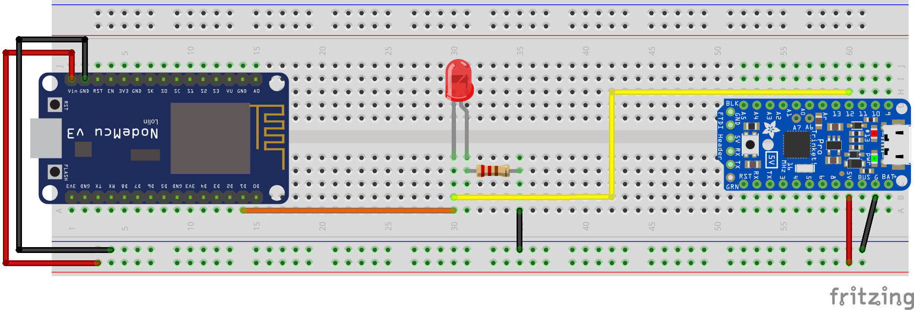

# Arza [](http://chevalvert.fr/)
> Monorepo for the Arza project

## Table of content

* [Table of content](#table-of-content)
* [Installation](#installation)
* [Hardware](#hardware)
* [Web client](#web-client)
  + [Options](#options)
    - [About `filenamePattern`](#about-filenamepattern)
  + [Note on static assets](#note-on-static-assets)
* [Generating the video](#generating-the-video)
  + [Install ImageMagick and verify your dependencies](#install-imagemagick-and-verify-your-dependencies)
  + [Basic Fourier transform using ImageMagick](#basic-fourier-transform-using-imagemagick)
  + [Generate the PNG sequence](#generate-the-png-sequence)
  + [Build the video from the PNG sequence](#build-the-video-from-the-png-sequence)
* [Development](#development)
* [License](#license)%

<br>
<br>

## Installation

```bash
$ git clone https://github.com/chevalvert/arza && cd arza
```

## Hardware

This project relies on a custom piece of hardware, which sniffs nearby WiFi probe requests, and send a fake keyPress on the client computer. It uses a NodeMCU in promiscuous mode, and a Trinket to simulate a keyboard.



See respectively [hardware/nodemcu](hardware/nodemcu/README.md) and [hardware/trinket](hardware/trinket/README.md) for instructions on how to flash the firmwares.

## Web client

To run the web client in production, simply open [`client/build/index.html`](client/build/index.html) in any modern web browser ([Google Chrome](https://www.google.com/chrome/) is recommended).

### Options

Setting the web client options can be done it two ways:
- in **development** via [`client/src/pages/pages.js`](client/src/pages/pages.js). This is the preferred way.
- in **production**, by editing directly the JSON object in [`client/build/index.html`](client/build/index.html). This is not ideal but useful for in-situ fine tuning.

In both cases, the option object is described below:

```js
{
  forceLogger: false, // Display logging informations, useful for debugging without devtools

  hardware: {
    key: 'p' // Key triggered by the Arza custom hardware
  },

  video: {
    source: 'arza-crop-pp.mp4', // Source of the video
    passivePlaybackRate: 0.25,  // Playback rate of the video when no trigger
    activePlaybackRate: 10      // Playback rate of the video during a trigger
  },

  SfxHandler: {
    soundsLength: 4,   // Length of SFX sound files
    speakersLength: 6, // Length of SFX spatialized versions
    filenamePattern: 'sfx/{{speakerIndex:1}}_AZ_Sfx{{soundIndex:01}}.wav'
  },

  DroneHandler: {
    soundsLength: 6,  // Length of Drone sound files
    filenamePattern: 'drones/Drones_AZ_{{soundIndex:01}}.wav'
  }
}
```

#### About `filenamePattern`

`SFxHandler` and `DroneHandler` options both have a `filenamePattern` key, defining how the filename is computed when fetched.

The basic syntax allows sequence definitions with custom n-based index and zero padding scheme:
```
{{index:1}}.wav   → 1.wav, 2.wav, 3.wav, …
{{index:0}}.wav   → 0.wav, 1.wav, 2.wav, …
{{index:01}}.wav  → 01.wav, 02.wav, 03.wav, …
{{index:000}}.wav → 000.wav, 001.wav, 002.wav, …
```

### Note on static assets

Due to size limitations, static assets such as sounds and video are not put under version control. They will need to be placed manually in the production [`client/build/`](client/build/) directory, alongside [`client/build/index.html`](client/build/index.html).

## Generating the video

The video used by the client is built from a PNG sequence generated with [ImageMagick](https://imagemagick.org/index.php) with [`fftw`](http://www.fftw.org/).

### Install ImageMagick and verify your dependencies

Refer to [ImageMagick](https://imagemagick.org/index.php) and [`fftw`](http://www.fftw.org/) for the installation process.

```bash
$ convert --version
> Version: ImageMagick 6.9.10-23 Q16 x86_64 20190101 https://imagemagick.org
> …
> Delegates (built-in): … fftw png tiff …
```

### Basic Fourier transform using ImageMagick

This is how the generation works:

```bash
# Resize input tif images
$ for i in {1..2}; do convert -monitor $i.tif -resize '1280>' $i.png; done

# FFT
$ for i in {1..2}; do convert -monitor $i.png -fft $i-fft.png; done

# This is just to see the spectrum, no need for computation
$ for i in {1..2}; do convert -monitor $i-fft-0.png -contrast-stretch 0 -evaluate log 10000 $i-fft-spectrum.png; done

# IFT
$ convert -monitor 1-fft-0.png 2-fft-1.png -ift arza.png
```
<sup>See [Fourier Transform Processing With ImageMagick
](http://www.fmwconcepts.com/imagemagick/fourier_transforms/fourier.html) for an in-depth tutorial</sup>

### Generate the PNG sequence

```bash
# Convert sources tif to exploitable png
convert -monitor 'A.tif' -resize '1920>' 'A.png'
convert -monitor 'B.tif' -resize '1920>' 'B.png'

# Apply Fast Fourier Transform to the image A
convert -monitor 'A.png' -fft 'A-fft.png'

# Apply hue rotation (from 0 to 100%) to the B image before applying FFT to it and merging
# the two domains into the final frame
mkdir 'frames'

for v in {0..1000..1}; do
  echo -e "\n$v"
  # Float division may not work in all shells: it will work in zsh
  convert -monitor 'B.png' -modulate 100,100,$(($v / 10.0)) -fft 'B-fft.png'
  convert -monitor "A-fft-0.png" "B-fft-1.png" -ift "frames/$v.png"
done
```

### Build the video from the PNG sequence

```bash
$ ffmpeg -framerate 24 -i 'frames/%d.png' -vf scale=1920:-1 -c:v libx264 -pix_fmt yuv420p 'arza.mp4'
$ ffmpeg -i 'arza.mp4' -filter:v 'crop=1920:1080:0:0' 'arza-cropped.mp4'
$ ffmpeg -i 'arza-cropped.mp4' -filter_complex '[0:v]reverse,fifo[r];[0:v][r] concat=n=2:v=1 [v]' -map '[v]' 'arza-cropped-ping-pong.mp4'
```

## Development

```console
$ npm install    # install all npm dependencies
$ npm run start  # start the web client dev server
$ npm run build  # build the web client in client/build
```

## License

[MIT.](https://tldrlegal.com/license/mit-license)

